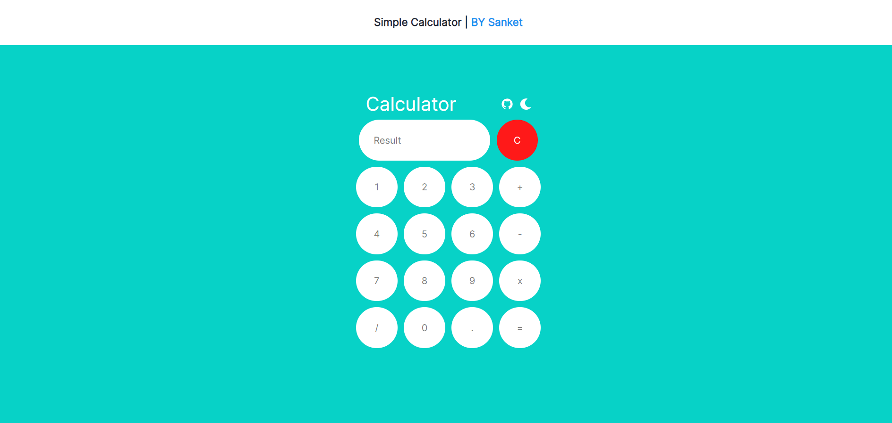
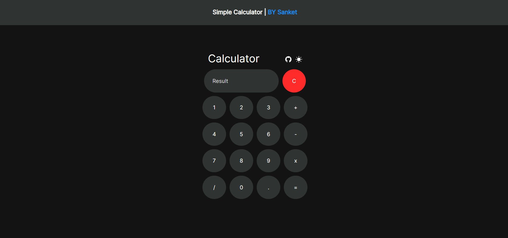

# CODSOFT_Intern_Calculator

# Overview
Welcome to the Calculator Project! This project was developed as a part of CodSoft Internship (Level-1 | Task-3). It is a feature-rich calculator application designed to provide a seamless and intuitive user experience.

# features
- **Responsive Design:** Utilizing Bootstrap for optimal viewing on various devices.
- **Dark Mode and Light Mode:** Choose between different visual themes for a personalized touch.
- **Input Support:** Accepts input through touch, keyboard key entry, and mouse pointer clicks.

## Screenshots
 
 

## Live Demo
Check out the live demo [here](https://sanket-santoki.github.io/CODSOFT_Intern_Calculator).

# Technologies Used:
- HTML
- CSS
- Bootstrap
- JavaScript

# Credits:
- Developed by Sanket Santoki
- Internship at CODSOFT

Thank you for exploring the Calculator Project! Feel free to reach out if you have any questions or suggestions.
